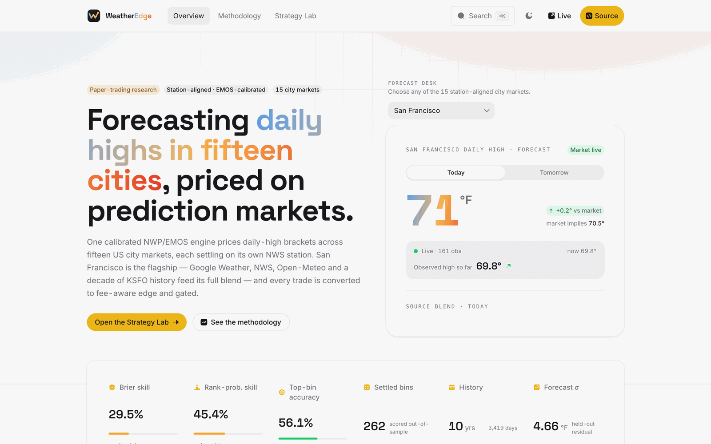

# WeatherEdge

**One calibrated NWP/EMOS engine forecasts daily-high temperature across fifteen US
city markets, then prices those forecasts against live Kalshi prediction-market
brackets — converting every candidate trade to fee-aware edge behind risk gates.**

[**▶ Live dashboard**](https://jaxsonb04.github.io/weather_edge/) ·
[Methodology](https://jaxsonb04.github.io/weather_edge/#/methodology) ·
[Strategy Lab](https://jaxsonb04.github.io/weather_edge/#/strategy) ·
[Architecture](docs/architecture.md)

[](https://github.com/Jaxsonb04/weather_edge/actions/workflows/verify.yml)

[](https://jaxsonb04.github.io/weather_edge/)

> **Paper trading only.** This project reads real Kalshi market prices for research
> and writes to a simulated journal. It places no live real-money orders — live
> execution is unimplemented and fail-closed (`trading/sfo_kalshi_quant/live_execution.py`
> raises `LiveTradingDisabled` and holds no authenticated client). Nothing here is
> financial advice.

## Results

**Forecast model — San Francisco flagship, held out-of-sample**

| Model | MAE | Gap vs. LSTM |
|---|---:|---:|
| **LSTM** (production) | **3.3°F** | — |
| XGBoost challenger | 3.9°F | −15.8% |
| Persistence baseline | 4.0°F | −17% |

*n = 442 held-out days. Diebold–Mariano p < 0.001; the LSTM wins 63% of days
head-to-head. Significance is tested, not asserted.*

**Probability engine — San Francisco, scored outcomes**

| Metric | Value |
|---|---:|
| Ranked-probability skill over climatology | 45.4% |
| Exact settlement-bin accuracy (~12 brackets, 2°F wide) | 56.1% |
| Brier skill | 29.5% |
| Held-out forecast residual (σ) | 4.66°F |

*n = 262 scored out-of-sample outcomes, anchored on 3,419 observed KSFO days
across 10 years. Skill varies sharply by regime — strongest in the cold (<60°F)
cohort, weakest in the normal 60–69°F band — and the risk gates size positions
accordingly.*

**What is not proven yet.** The LSTM, the Google Weather blend, and the
marine-layer features are San Francisco–only extras, not the universal method.
The other fourteen cities run the shared Tier-1 EMOS pipeline and are
**backtest-grade with only a short live history**, so they do not yet carry a
comparable live track record. The paper book's lifetime result is a small
negative; see [Strategy Lab](https://jaxsonb04.github.io/weather_edge/#/strategy)
for the current standing.

## How It Works

```text
Open-Meteo previous-runs archive        ─┐
  (9 NWP models, leads 1–3,              │
   leakage-free: only cycles that        ├─► per-city EMOS ─► calibrated
   existed before the target)            │   post-processing   Gaussian (μ, σ)
                                         │
NOAA/KSFO 10-year station history       ─┤                          │
Google Weather (budgeted)  ── SFO only  ─┤                          ▼
LSTM + marine-layer        ── SFO only  ─┘            bracket probability engine
                                                                    │
                                                                    ▼
NWS Climatological Report (CLI)  ──► settlement truth   fee-aware edge + risk gates
  per city, its own station                                         │
                                                                    ▼
                                                        paper journal ─► React SPA
```

Every market settles on its own NWS Climatological Report, and each city's
climate day runs midnight-to-midnight in local standard time. The forecaster
never grades itself — settlement truth comes from the official CLI product.

**Design decisions worth noting.** The NWP archive is pulled leakage-free (only
model cycles that were actually available before the target time). EMOS is
fitted rolling-origin per station rather than pooled. The trade engine is
maker-first with fee-aware edge, and the whole book is gated on a readiness
check that has not yet passed — which is why it remains paper-only.

## Stack

| Layer | Tech |
|---|---|
| Forecasting | Python, PyTorch (LSTM), XGBoost, EMOS post-processing, SQLite |
| Trading engine | Python, fee-aware edge, risk gates, paper journal |
| Web | React, TypeScript, Vite, HeroUI Pro, bun |
| Infra | AWS EC2, systemd timers, S3 archive, GitHub Pages |
| Quality | pytest (122 test files), semgrep, oxlint, hash-pinned deps, CI bundle budget |

The Python surface is ~65k lines against ~56k lines of tests.

## Engineering Notes

Things a reviewer might want to look at directly:

- **[docs/accuracy_evaluation_2026-07-06.md](docs/accuracy_evaluation_2026-07-06.md)** —
  Diebold–Mariano-gated CRPS head-to-head, including a section on hypotheses
  *not* acted on because the confidence intervals overlapped.
- **[docs/trading_retune_validation_2026-06-17.md](docs/trading_retune_validation_2026-06-17.md)** —
  a retune that measured +8.49% and was rejected as noise.
- **[docs/trade_engine_overhaul_plan_2026-06-17.md](docs/trade_engine_overhaul_plan_2026-06-17.md)** —
  why win-rate was refused as a success metric (it is trivially maximized by
  betting deep favorites into an EV-negative book).
- **[docs/MULTICITY-2026-07.md](docs/MULTICITY-2026-07.md)** — the 1→15 city
  redesign, with the required sample size derived from published variance.
- **[trading/docs/strategy.md](trading/docs/strategy.md)** — posterior
  construction, gate structure, and the two risk profiles.
- **[docs/ai-assisted-development.md](docs/ai-assisted-development.md)** — how
  this project uses AI coding agents, the verification harness that gates them,
  and three cases where that harness failed.
- **[.github/workflows/verify.yml](.github/workflows/verify.yml)** — CI across
  two Python versions with a semgrep pass, a bytecode gate, and an enforced
  SPA bundle budget.

## Cities

The city registry is `forecaster/cities.py`, duplicated byte-identically as
`trading/sfo_kalshi_quant/cities.py` (a parity test enforces this). Each entry
defines the slug, name, Kalshi series ticker, NWS settlement station, CLI
product (site + issuedby), lat/lon, civil timezone, and fixed standard-time UTC
offset.

Forecasting is two-tier:

- **SFO** keeps the full legacy blend: Google Weather (budgeted), LSTM,
  marine-layer features, plus the NWP/EMOS archive.
- **All other cities** run the station-agnostic NWP→EMOS→CLI path only:
  Open-Meteo previous-runs archive (9 models, leads 1-3), rolling-origin EMOS
  per city, and settlement truth in the station-keyed `cli_settlements` table
  fed by live CLI scans plus the IEM archive backfill
  (`forecaster/city_truth.py`).

## What Is Here

```text
WeatherEdge/
  forecaster/   weather pipeline: SFO blend, multi-city NWP/EMOS archive,
                cities.py registry, CLI settlement truth
  trading/      Kalshi probability, risk gates, CLI, paper journal, AWS scripts
  src/          React SPA (the public site), built with bun + Vite
  docs/         unified guides, glossary, sync/deploy notes
  pyproject.toml
  CONTEXT.md
```

## Quick Start

```bash
cd /path/to/WeatherEdge
python3 -m venv .venv
source .venv/bin/activate
pip install -e ".[dev]"
python -m pytest trading/tests forecaster/tests -q
```

Without installing first, use the helper:

```bash
bash scripts/run_tests.sh
```

Before syncing, pushing, or deploying, run the full local verification gate:

```bash
bash scripts/verify_project.sh
```

It runs the WeatherEdge health check, trading tests, and Python compile check.
Warnings about Git not being initialized or Semgrep not being installed are
informational until you decide to turn those on.

Analyze today and tomorrow with paper-trading gates. The loop covers all
fifteen registered cities by default (env `PAPER_CITIES`, default `all`); pass
`--cities` with a comma list of slugs to narrow it:

```bash
python -m sfo_kalshi_quant.cli --no-color analyze --target-date both --side both
python -m sfo_kalshi_quant.cli --no-color analyze --target-date both --side both --cities sfo,lax
```

Without installing first:

```bash
bash scripts/paper_analyze.sh
```

Paper analysis defaults to the `live` paper-research profile (the stricter,
real-trading-candidate book, paper-only until a readiness gate passes). Use
`--risk-profile research` when you want the loosest paper-only gates at the
smallest size so the journal fills faster with the full opportunity set:

```bash
python -m sfo_kalshi_quant.cli --no-color --risk-profile live analyze --target-date both
python -m sfo_kalshi_quant.cli --no-color --risk-profile research analyze --target-date rolling --side both --place-paper --paper-stake 5
```

To run live and research side by side in one paper DB, set:

```bash
PAPER_RISK_PROFILES=live,research bash scripts/paper_analyze.sh --target-date rolling --place-paper
```

Record paper trades only when the CLI says `TRADE`:

```bash
python -m sfo_kalshi_quant.cli --no-color analyze --target-date both --side both --paper-stake 10 --place-paper
```

## Forecast Workflow

Run forecaster commands from `forecaster/` because the offline research tools
use project-relative data and artifact paths:

```bash
cd /path/to/WeatherEdge/forecaster
python research/combine_psv.py --dir "2016-2026 weather data" --out combined_weather.csv
python research/load_to_db.py
python research/features.py
python research/forecast_tomorrow.py
python nws_ground_truth.py --days 14
python google_weather_cache.py
```

Refreshing Google Weather requires `GOOGLE_WEATHER_API_KEY`. The project keeps
Google usage disciplined with an 8,000/month and 260/day default event budget,
below the 10,000 free monthly cap.

These commands drive the SFO legacy blend. The other fourteen cities run
through the NWP→EMOS path (`nwp_archive.py`, `emos_forecast.py`) with CLI
settlement truth from `city_truth.py`; the AWS timers run these with
`--cities all`.

## Public Website (React SPA)

The public site is a React + Vite + HeroUI Pro single-page app at the repo root
(`src/`, `index.html`, `vite.config.ts`), built with bun:

```bash
bun install --frozen-lockfile # HeroUI Pro registry auth required (HEROUI_AUTH_TOKEN)
bun run build # outputs dist/
```

> **Note for reviewers:** the SPA depends on `@heroui-pro/react`, a commercially
> licensed component library. Without a HeroUI Pro token the web build cannot be
> reproduced locally. The Python forecasting and trading packages have no such
> restriction and build and test freely — and the deployed site is always live at
> the link above.

Before releasing a new SPA build, capture the initial hard-load resource list
with browser automation and run both bundle views. The manifest report is
structural only; the browser-observed gate is the runtime proof:

```bash
bun run bundle:report
bun run bundle:check:observed -- /tmp/weatheredge-initial-resources.txt
```

The observed list must come from the same `dist/` build. The gate rejects stale
chunk hashes and enforces the initial JS/CSS budgets.

Production serves the prebuilt app from the deployment web root on the EC2
box; `trading/deploy/aws/publish_forecaster_pages.sh` publishes it to
the `gh-pages` branch with the freshly generated data JSONs
(`trading_signal.json`, `forecast_data.json`, `weather_story_data.json`,
`strategy_research.json`, `cities_data.json`) overlaid on every refresh cycle.
The site includes a fifteen-city Coverage grid fed by `cities_data.json`
(per-city forecasts, latest settlement, book activity), with SFO presented as
the flagship.

## Kalshi Workflow

Run trading commands from the repository root after installing with
`pip install -e .`. The root `pyproject.toml` is the repository's sole Python
install manifest and owns both the `sfo_kalshi_quant` package and the
`sfo-kalshi` console script.

Important commands:

```bash
python -m sfo_kalshi_quant.cli backtest-calibration
python -m sfo_kalshi_quant.cli backtest-calibration --source clean-blend
python -m sfo_kalshi_quant.cli daily-report --target-date both --side both --format json --no-live-market --output forecaster/trading_signal.json
python -m sfo_kalshi_quant.cli strategy-research --output forecaster/strategy_research.json
python -m sfo_kalshi_quant.cli analyze --target-date both --side both
python -m sfo_kalshi_quant.cli analyze --target-date both --side both --cities sfo,lax
python -m sfo_kalshi_quant.cli backtest-signals
python -m sfo_kalshi_quant.cli paper-report
python -m sfo_kalshi_quant.cli paper-monitor
python -m sfo_kalshi_quant.cli paper-settle --target-date YYYY-MM-DD --settlement-high 67
```

`daily-report` is read-only dashboard input; it does not record DB snapshots or
place paper orders.

Strategy Lab defaults to the `live` profile view, so the wider-net
`research` results do not contaminate the `live` headline P&L, hit rate,
open risk, daily rows, signals, actions, or learnings. The AWS
strategy-lab refresh timer republishes those trading results every fifteen
minutes without calling the paid Google Weather refresh path.

`backtest-calibration --source clean-blend` validates the archived live blend on
clean next-day forecasts only. It excludes same-day observed-high lock/floor
rows.

`--settlement-high 67` means the official resolved SFO high was 67°F for that
date. Exposure caps and settlement are series-scoped, so one city's high can
never settle another city's bins; automatic settlement walks each city's own
NWS CLI product, with archived CLI truth as fallback.

## Repository Sync

Configure a Git remote and review ignored files before publishing changes:

```bash
git status
git status --ignored
```

See [docs/aws_deployment.md](docs/aws_deployment.md) for the deployment layout.

## Data And Artifacts

Local WeatherEdge may include copied raw KSFO NOAA station files and ignored
runtime artifacts from previous runs. After AWS sync and refresh, live
DB/cache/dashboard state is authoritative on AWS, not on a local machine. Clear
stale local runtime state before dashboard design smoke tests:

```bash
python3 scripts/clear_local_runtime_state.py --confirm
```

The root `.gitignore` prevents large raw data and live runtime DB/cache files
from being committed accidentally.

See [docs/data_and_artifacts.md](docs/data_and_artifacts.md).

## Learning Path

Start with:

1. [docs/glossary.md](docs/glossary.md)
2. [trading/docs/user_guide.md](trading/docs/user_guide.md)
3. [docs/architecture.md](docs/architecture.md)
4. [docs/operational_runbook.md](docs/operational_runbook.md)
5. [docs/research_improvement_review.md](docs/research_improvement_review.md)

The math should stay auditable: probability, calibration, risk gates, observed
high locks, and paper PnL should be explainable from code and docs.

## License

MIT — see [LICENSE](LICENSE).
