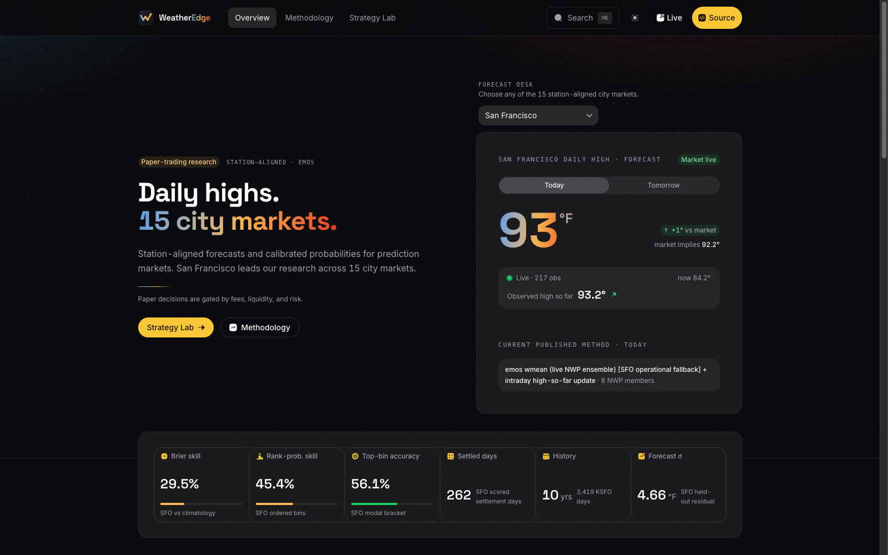

# WeatherEdge

**One calibrated NWP/EMOS engine forecasts daily-high temperature across fifteen US
city markets, then prices those forecasts against live Kalshi prediction-market
brackets — converting every candidate trade to fee-aware edge behind risk gates.**

[**▶ Live dashboard**](https://jaxsonb04.github.io/weather_edge/) ·
[Methodology](https://jaxsonb04.github.io/weather_edge/#/methodology) ·
[Strategy Lab](https://jaxsonb04.github.io/weather_edge/#/lab) ·
[Architecture](docs/architecture.md) ·
[Codebase walkthrough](docs/CODEBASE-WALKTHROUGH.md)

[](https://github.com/Jaxsonb04/weather_edge/actions/workflows/verify.yml)

[](https://jaxsonb04.github.io/weather_edge/)

> **Paper trading only.** This project reads real Kalshi market prices for research
> and writes to a simulated journal. It places no live real-money orders — live
> execution is unimplemented and fail-closed (`trading/sfo_kalshi_quant/live_execution.py`
> raises `LiveTradingDisabled` and holds no authenticated client). Nothing here is
> financial advice.
>
> As of the last production verification (2026-08-16), strict readiness is
> **`REPLAY_REQUIRED` — 4 of 12 checks, 43.6%, on four complete post-boundary
> settlement days.** That is *lower* than an earlier 8/12 reading, because the
> readiness evaluator was hardened, not because the book got worse: the old
> number mixed policy eras and computed economics from partially observed target
> days. The 8/12 result is superseded and should not be quoted. See
> [Operational State](#operational-state).

## Results

**Forecast model — San Francisco flagship, held out-of-sample**

| Paired model | MAE | Difference vs. LSTM |
|---|---:|---:|
| **SFO LSTM residual model** | **3.12°F** | — |
| XGBoost challenger | 3.71°F | +0.59°F |

*n = 442 held-out days. Diebold–Mariano p < 0.001; the LSTM wins 63% of days
head-to-head, with a 15.8% MAE reduction. In the separate baseline summary,
LSTM MAE is 3.30°F versus persistence at 3.97°F. Significance is tested, not
asserted.*

**Probability engine — San Francisco, scored outcomes**

| Metric | Value |
|---|---:|
| Ranked-probability skill over climatology | 45.4% |
| Exact settlement-bin accuracy (~12 brackets, 2°F wide) | 56.1% |
| Brier skill | 29.5% |
| Held-out forecast residual (σ) | 4.66°F |

*n = 262 scored out-of-sample outcomes, anchored on 3,419 observed KSFO days
across 10 years. Skill varies sharply by regime — strongest in the cold (<60°F)
cohort, weakest in the normal 60–69°F band — and the risk gates size positions
accordingly.*

**What is not proven yet.** The LSTM residual-calibration study, optional Google
Weather input, and marine-layer features are San Francisco–only evidence layers,
not the universal point-forecast method. The current SFO point forecast can fall
back to the shared EMOS weighted mean when optional inputs are absent. The other
fourteen cities run that shared EMOS pipeline and have only a short operational
record. Active paper ledgers and archived strategy
attribution are reported separately; see
[Strategy Lab](https://jaxsonb04.github.io/weather_edge/#/lab) for the current
evidence and account-scoped standing.

## How It Works

```text
Open-Meteo previous-runs archive        ─┐
  (8 NWP members, leads 1–3,             │
   leakage-free: only cycles that        ├─► per-city EMOS ─► calibrated
   existed before the target)            │   post-processing   Gaussian (μ, σ)
                                         │
NOAA/KSFO 10-year station history       ─┤                          │
Google Weather (optional)  ── SFO only  ─┤                          ▼
LSTM residual + marine     ── SFO only  ─┘            bracket probability engine
                                                                    │
                                                                    ▼
NWS Climatological Report (CLI)  ──► settlement truth   fee-aware edge + risk gates
  per city, its own station                                         │
                                                                    ▼
                                                        paper journal ─► React SPA
```

Apple WeatherKit runs in production as a private research source for all fifteen
station coordinates (deployed 2026-08-10). It is deliberately outside the
diagram's prediction path and stays there: **its trading weight is exactly
zero.** Values live in a mode-0600 tmpfs cache, expire at Apple's own
`metadata.expireTime`, and never enter `weather.db`, `nwp_model_forecasts`, EMOS
fitting, training archives, paper-decision snapshots, public JSON, or logs.
Activation therefore cannot move a forecast probability, a risk gate, a size, or
a paper decision.

Promotion to nonzero weight is blocked on more than evidence: under the current
Apple Developer Program License Agreement Attachment 8 storage restrictions,
Apple-only forecast vintages and residuals are not durably archived, so the
historical evaluation that would justify a weight cannot yet be built. See
[the WeatherKit boundary](docs/APPLE-WEATHERKIT.md).

Every market settles on its own NWS Climatological Report, and each city's
climate day runs midnight-to-midnight in local standard time. The forecaster
never grades itself — settlement truth comes from the official CLI product.

**Design decisions worth noting.** The NWP archive is pulled leakage-free (only
model cycles that were actually available before the target time). EMOS is
fitted rolling-origin per station rather than pooled. The trade engine uses
reservation-price limit execution with gated taker crosses where configured,
and the whole book is gated on a readiness check that has not passed — which is
why it remains paper-only, and why hardening that check *lowered* the score
rather than raising it.

## Stack

| Layer | Tech |
|---|---|
| Forecasting | Python, PyTorch (LSTM), XGBoost, EMOS post-processing, SQLite |
| Trading engine | Python, fee-aware edge, risk gates, paper journal |
| Web | React 19, TypeScript, Vite, HeroUI Pro, bun, Recharts, MapLibre GL |
| Infra | AWS EC2 (us-west-1), systemd timers, S3 archive, GitHub Pages |
| Quality | pytest (136 test files), Vitest (38 files), semgrep, oxlint, hash-pinned deps, CI bundle budget |

Measured at the current revision: **2,721 Python tests passed, 8 skipped**;
**166 frontend tests across 38 files**.

## Operational State

Last verified 2026-08-16 on runtime revision `c82a67e0f`. This section is a
snapshot, not a live readout — `docs/SESSION_MEMORY.md` is the rolling record.

| | |
|---|---|
| Real-money trading | **Off.** `enabled=0`, `dry_run=1`, no authenticated write client deployed |
| Strict readiness | `REPLAY_REQUIRED` — 4/12 checks, 43.6%, 4 complete post-boundary settlement days |
| Scheduled units | 14 canonical timers enabled and active; 29 canonical units matching templates; 0 failed |
| Paper ledgers | Live Stability (from 2026-07-26) and Research ROI (from 2026-08-01), **economically separate** |
| Paper database | ~18.4 GB; disk 45% used, ~34 GiB free |
| Retention | `SFO_PRUNE_MODE=archive-only` by default — see below |

**Two things a reader should not misread.**

*Readiness got stricter, not better.* PR #96 made the evaluator fail closed on
incomplete forecast, settlement, replay, and maker-fill evidence; it now
qualifies whole weather days, requires exact per-series policy fingerprints, and
rejects mixed policy eras. It also made future-live limits capital-relative
rather than hardcoded — currently $1,000 capital, 1% per order ($10), 2% daily
loss ($20), 5% total pilot loss ($50). None of that turns anything on.

*Retention deliberately does not delete.* The nightly retention service defaults
to `archive-only`: it exports, rolls up, uploads, runs the archive gate and
foreign-key audit, then **skips the live-journal prune**, emits a `DEGRADED`
diagnostic, and exits successfully rather than taking a long write lock and
failing the unit. Unknown mode values fail closed to the same no-delete
behavior. This means the live SQLite journal grows on purpose, and database
growth is an open operational risk guarded by the 85% disk watchdog — which
alarms but never deletes. The only opt-in is the exact `quiesced-delete` mode,
for a supervised run after every journal writer is stopped; restore
`archive-only` before timers resume.

## Engineering Notes

Things a reviewer might want to look at directly:

- **[docs/CODEBASE-WALKTHROUGH.md](docs/CODEBASE-WALKTHROUGH.md)** — the
  17-gear architecture map and the R01–R46 review register. Note its own
  caveat: the register is not a work queue until each remaining entry gets the
  same spot-check R03 received.
- **[docs/CODEBASE-REVIEW-DIALOGUE.md](docs/CODEBASE-REVIEW-DIALOGUE.md)** — the
  D001–D004 decision record. These are owner *proposals*, not authorizations;
  D002 in particular records a direction to give Apple WeatherKit nonzero
  forecast influence, which has not been granted.
- **[docs/SESSION_MEMORY.md](docs/SESSION_MEMORY.md)** — the rolling
  cross-session handoff: last verified production state, root causes, and the
  P&L interpretation rules that keep separate ledgers separate.
- **[docs/APPLE-WEATHERKIT.md](docs/APPLE-WEATHERKIT.md)** — the zero-weight
  boundary, the runtime contract, and the licensing reason evaluation is stalled.
- **[docs/accuracy_evaluation_2026-07-06.md](docs/accuracy_evaluation_2026-07-06.md)** —
  Diebold–Mariano-gated CRPS head-to-head, including a section on hypotheses
  *not* acted on because the confidence intervals overlapped.
- **[docs/trading_retune_validation_2026-06-17.md](docs/trading_retune_validation_2026-06-17.md)** —
  a retune that measured +8.49% and was rejected as noise.
- **[docs/trade_engine_overhaul_plan_2026-06-17.md](docs/trade_engine_overhaul_plan_2026-06-17.md)** —
  why win-rate was refused as a success metric (it is trivially maximized by
  betting deep favorites into an EV-negative book).
- **[docs/MULTICITY-2026-07.md](docs/MULTICITY-2026-07.md)** — the 1→15 city
  redesign, with the required sample size derived from published variance.
- **[docs/BREADTH-PLAYBOOK.md](docs/BREADTH-PLAYBOOK.md)** — the size-curve
  study that was closed rather than extended: scaling saturates at 3.0×, with a
  stop rule and a geometry-invariant test written down so the result cannot be
  quietly relitigated.
- **[docs/RESEARCH-ROI-V6-2026-08-05.md](docs/RESEARCH-ROI-V6-2026-08-05.md)** —
  a near-5% paper day audited without changing policy in response to it.
- **[trading/docs/strategy.md](trading/docs/strategy.md)** — posterior
  construction, gate structure, and the two risk profiles.
- **[docs/ai-assisted-development.md](docs/ai-assisted-development.md)** — how
  this project uses AI coding agents, the verification harness that gates them,
  and three cases where that harness failed.
- **[.github/workflows/verify.yml](.github/workflows/verify.yml)** — CI across
  Python 3.12 and 3.13 with a semgrep pass and a bytecode gate, plus a bun web
  job that lints, tests, builds, and then enforces the SPA bundle budget
  **twice**: once structurally from the manifest, and once against a real
  Chrome hard-load, which is the view that actually catches a regression.

## Cities

The city registry is `forecaster/cities.py`, duplicated byte-identically as
`trading/sfo_kalshi_quant/cities.py` (a parity test enforces this). Each entry
defines the slug, name, Kalshi series ticker, NWS settlement station, CLI
product (site + issuedby), lat/lon, civil timezone, and fixed standard-time UTC
offset.

Forecasting is two-tier:

- **SFO** is blend-capable: it can add a fresh budgeted Google Weather value,
  LSTM residual-calibration evidence, and marine-layer features to the shared
  NWP/EMOS base. Its operational point forecast falls back to EMOS when optional
  inputs are unavailable.
- **All other cities** run the station-agnostic NWP→EMOS→CLI path only:
  Open-Meteo previous-runs archive (8 members, leads 1-3), rolling-origin EMOS
  per city, and settlement truth in the station-keyed `cli_settlements` table
  fed by live CLI scans plus the IEM archive backfill
  (`forecaster/city_truth.py`).

## What Is Here

```text
WeatherEdge/
  forecaster/   weather pipeline: SFO blend, multi-city NWP/EMOS archive,
                cities.py registry, CLI settlement truth, apple_weatherkit.py
  trading/      Kalshi probability, risk gates, CLI, paper journal, AWS deploy
                (sfo_kalshi_quant/ is the installed package; 116 test files)
  src/          React SPA (the public site), built with bun + Vite
  scripts/      verification gate, bundle report/capture, runtime-state reset
  docs/         guides, glossary, audits, walkthrough, rolling session memory
  pyproject.toml   sole Python install manifest (forecaster / train / dev extras)
  CONTEXT.md
```

`pyproject.toml` splits dependencies on purpose: `[forecaster]` is the light set
the production box installs, and `[train]` (torch, xgboost, scikit-learn,
matplotlib) is offline-only and must never be installed on that box.

## Quick Start

```bash
cd /path/to/WeatherEdge
python3 -m venv .venv
source .venv/bin/activate
pip install -e ".[dev]"
python -m pytest trading/tests forecaster/tests -q
```

Without installing first, use the helper:

```bash
bash scripts/run_tests.sh
```

Before syncing, pushing, or deploying, run the full local verification gate:

```bash
bash scripts/verify_project.sh
```

It runs the WeatherEdge health check, trading tests, and Python compile check.
Warnings about Git not being initialized or Semgrep not being installed are
informational until you decide to turn those on.

Analyze today and tomorrow with paper-trading gates. The loop covers all
fifteen registered cities by default (env `PAPER_CITIES`, default `all`); pass
`--cities` with a comma list of slugs to narrow it:

```bash
python -m sfo_kalshi_quant.cli --no-color analyze --target-date both --side both
python -m sfo_kalshi_quant.cli --no-color analyze --target-date both --side both --cities sfo,lax
```

Without installing first:

```bash
bash scripts/paper_analyze.sh
```

Paper analysis defaults to the `live` paper-readiness profile. The
`--risk-profile research` option evaluates the research candidate path; with
`--place-paper`, the current policy routes admitted entries into the active
versioned Research ROI sleeve. Archived motion and superseded policy rows are
read-only evidence:

```bash
python -m sfo_kalshi_quant.cli --no-color --risk-profile live analyze --target-date both
python -m sfo_kalshi_quant.cli --no-color --risk-profile research analyze --target-date rolling --side both --place-paper --paper-stake 5
```

To run live and research side by side in one paper DB, set:

```bash
PAPER_RISK_PROFILES=live,research bash scripts/paper_analyze.sh --target-date rolling --place-paper
```

Record paper trades only when the CLI says `TRADE`:

```bash
python -m sfo_kalshi_quant.cli --no-color analyze --target-date both --side both --paper-stake 10 --place-paper
```

## Forecast Workflow

Run forecaster commands from `forecaster/` because the offline research tools
use project-relative data and artifact paths:

```bash
cd /path/to/WeatherEdge/forecaster
python research/combine_psv.py --dir "2016-2026 weather data" --out combined_weather.csv
python research/load_to_db.py
python research/features.py
python research/forecast_tomorrow.py
python nws_ground_truth.py --days 14
python google_weather_cache.py
```

Refreshing Google Weather requires `GOOGLE_WEATHER_API_KEY`. The project keeps
Google usage disciplined with an 8,000/month and 260/day default event budget,
below the 10,000 free monthly cap.

The Apple source runs separately with `python apple_weatherkit.py --cities all`.
It requires WeatherKit REST credentials and `ENABLE_APPLE_WEATHER=1`, and exits
safely without a request when the flag is off. In production it is **on**, at
four fixed UTC vintages (02:17, 08:17, 14:17, 20:17) — one bundled hourly+daily
request per city per vintage, 60 scheduled calls/day. A separate ten-minute
purge bounds unattended expiry. The source is shadow-only and cannot alter the
forecast or trading engine.

These commands drive the SFO legacy blend. The other fourteen cities run
through the NWP→EMOS path (`nwp_archive.py`, `emos_forecast.py`) with CLI
settlement truth from `city_truth.py`; the AWS timers run these with
`--cities all`.

## Public Website (React SPA)

The public site is a React + Vite + HeroUI Pro single-page app at the repo root
(`src/`, `index.html`, `vite.config.ts`), built with bun:

```bash
bun install --frozen-lockfile # HeroUI Pro registry auth required (HEROUI_AUTH_TOKEN)
bun run build # outputs dist/
```

> **Note for reviewers:** the SPA depends on `@heroui-pro/react`, a commercially
> licensed component library. Without a HeroUI Pro token the web build cannot be
> reproduced locally. The Python forecasting and trading packages have no such
> restriction and build and test freely. Publication freshness at the link above
> is reported by the public manifest.

Before releasing a new SPA build, capture the initial hard-load resource list
with browser automation and run both bundle views. The manifest report is
structural only; the browser-observed gate is the runtime proof:

```bash
bun run bundle:report
bun run bundle:check:observed -- /tmp/weatheredge-initial-resources.txt
```

The observed list must come from the same `dist/` build. The gate rejects stale
chunk hashes and enforces the initial JS/CSS budgets.

Production serves the prebuilt app from the deployment web root on the EC2
box; `trading/deploy/aws/publish_forecaster_pages.sh` publishes it to
the `gh-pages` branch with the freshly generated data JSONs
(`trading_signal.json`, `forecast_data.json`, `weather_story_data.json`,
`strategy_research.json`, `cities_data.json`) overlaid on every refresh cycle.
The site includes a fifteen-city Coverage grid fed by `cities_data.json`
(per-city forecasts, latest settlement, book activity), with SFO presented as
the flagship.

## Kalshi Workflow

Run trading commands from the repository root after installing with
`pip install -e .`. The root `pyproject.toml` is the repository's sole Python
install manifest and owns both the `sfo_kalshi_quant` package and the
`sfo-kalshi` console script.

Important commands:

```bash
python -m sfo_kalshi_quant.cli backtest-calibration
python -m sfo_kalshi_quant.cli backtest-calibration --source clean-blend
python -m sfo_kalshi_quant.cli daily-report --target-date both --side both --format json --no-live-market --output forecaster/trading_signal.json
python -m sfo_kalshi_quant.cli strategy-research --output forecaster/strategy_research.json
python -m sfo_kalshi_quant.cli analyze --target-date both --side both
python -m sfo_kalshi_quant.cli analyze --target-date both --side both --cities sfo,lax
python -m sfo_kalshi_quant.cli backtest-signals
python -m sfo_kalshi_quant.cli paper-report
python -m sfo_kalshi_quant.cli paper-monitor
python -m sfo_kalshi_quant.cli paper-settle --target-date YYYY-MM-DD --settlement-high 67
```

`daily-report` is read-only dashboard input; it does not record DB snapshots or
place paper orders.

Strategy Lab defaults to the Live Stability paper-readiness view. The active
versioned Research ROI sleeve and every archive remain economically separate,
so their balances, positions, and P&L are never presented as one account. The
AWS strategy-lab refresh timer republishes those results every five
minutes without calling the paid Google Weather refresh path.

`backtest-calibration --source clean-blend` validates the archived live blend on
clean next-day forecasts only. It excludes same-day observed-high lock/floor
rows.

`--settlement-high 67` means the official resolved SFO high was 67°F for that
date. Exposure caps and settlement are series-scoped, so one city's high can
never settle another city's bins; automatic settlement walks each city's own
NWS CLI product, with archived CLI truth as fallback.

## Repository Sync

Configure a Git remote and review ignored files before publishing changes:

```bash
git status
git status --ignored
```

See [docs/aws_deployment.md](docs/aws_deployment.md) for the deployment layout.

## Data And Artifacts

Local WeatherEdge may include copied raw KSFO NOAA station files and ignored
runtime artifacts from previous runs. After AWS sync and refresh, live
DB/cache/dashboard state is authoritative on AWS, not on a local machine. Clear
stale local runtime state before dashboard design smoke tests:

```bash
python3 scripts/clear_local_runtime_state.py --confirm
```

The root `.gitignore` prevents large raw data and live runtime DB/cache files
from being committed accidentally.

On the production box the paper database is around 18.4 GB and growing by
design, because scheduled retention is `archive-only` and does not prune the
live journal (see [Operational State](#operational-state)). Deleting rows would
not shrink the file on its own — freed pages become reusable, and filesystem
reclamation still needs the separately quiesced compaction workflow.

See [docs/data_and_artifacts.md](docs/data_and_artifacts.md).

## Learning Path

Start with:

1. [docs/glossary.md](docs/glossary.md)
2. [trading/docs/user_guide.md](trading/docs/user_guide.md)
3. [docs/architecture.md](docs/architecture.md)
4. [docs/CODEBASE-WALKTHROUGH.md](docs/CODEBASE-WALKTHROUGH.md)
5. [docs/operational_runbook.md](docs/operational_runbook.md)
6. [docs/research_improvement_review.md](docs/research_improvement_review.md)

Before making an operational claim, read
[docs/SESSION_MEMORY.md](docs/SESSION_MEMORY.md) — and then check current AWS
state anyway. The memory file records what was last *verified*, which is not
the same as what is true right now.

The math should stay auditable: probability, calibration, risk gates, observed
high locks, and paper PnL should be explainable from code and docs.

## License

MIT — see [LICENSE](LICENSE).
