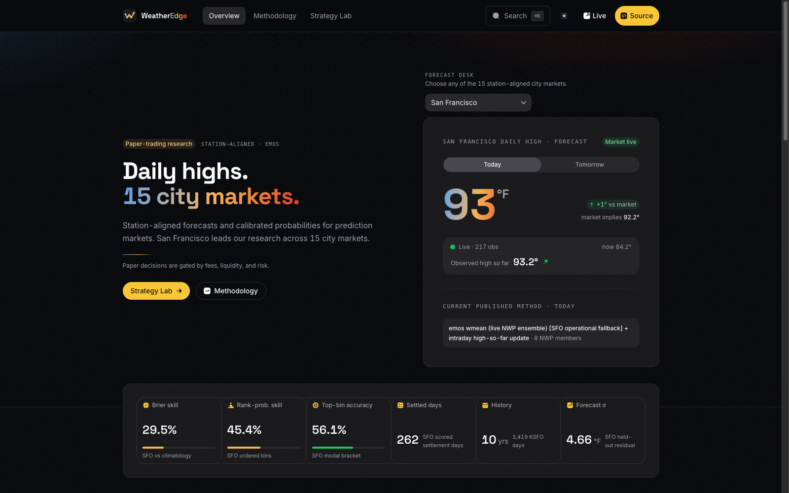

# WeatherEdge

WeatherEdge forecasts station daily-high temperatures, converts distributions
into prediction-market bracket probabilities, and tests fee-aware trading
policies in separate paper accounts. It combines weather ingestion,
probabilistic calibration, orderbook evidence, simulated execution, official
settlement, AWS operations, and a React evidence dashboard.

[Live dashboard](https://jaxsonb04.github.io/weather_edge/) ·
[Strategy Lab](https://jaxsonb04.github.io/weather_edge/#/lab) ·
[Repository map](docs/REPOSITORY_MAP.md) ·
[Architecture](docs/architecture.md) ·
[Project case study](docs/PROJECT_CASE_STUDY.md) ·
[AI-assisted development](docs/ai-assisted-development.md)

[](https://github.com/Jaxsonb04/weather_edge/actions/workflows/verify.yml)

[](https://jaxsonb04.github.io/weather_edge/)

**Paper trading only.** The engine reads real Kalshi public prices and records
simulated orders. `live_execution.py` rejects non-dry orders; no authenticated
real-money execution client is implemented. Paper fills do not establish that
an equivalent real order would fill.

## Current evidence and v7

The **October 5, 2026, 19:52 PDT production snapshot** still ran backend revision
`2a6432e3`, with fifteen city markets. The current source registry covers twenty.
Repository source, installed backend, SPA assets, and generated runtime data
have separate provenance; a merged fix is not proof of a deployed fix.

| Area | Source capability and observed deployment |
|---|---|
| Coverage | 20 city markets, with fifteen verified in the October 5 production snapshot |
| Policy | v7 source revision; the October 5 production baseline was v6 |

At that snapshot, the separate $1,000 initial-capital accounts reported:

| Paper account | Realized P&L | Return on initial capital |
|---|---:|---:|
| Live Stability | +$58.67 | +5.867% |
| Research ROI v6 | +$17.93 | +1.793% |

Research v6 earned $17.93 on $3,927.86 of resolved entry capital: **0.4564%
resolved-capital ROI**. Its approximately 72% profitable-exit rate did not imply
strong net profit. These accounts are economically separate; their profits and
balances must not be treated as one bankroll.

The [v7 audit](docs/research/2026-10-05-v7-audit.md) records the measured baseline,
release gap, thin fill capture, concentrated losses, stale analysis, and
reproduced forecast/exit evidence defects. Source corrections require verified
deployment and prospective validation. v7 starts a separate research paper
account; v6 and earlier histories keep their original attribution, policy, and
settlement lifecycle. Strategy Lab shows the policy version in its artifact and
all published archived profiles, including zero-trade experiments.

The fresh [forecast baseline](docs/research/2026-10-05-v7-forecast-baseline.json)
records 125,170 NWP member rows and 10,642 source-separated scored cases. Its
1.80°F MAE and 1.30°F CRPS describe reconstructed archive skill; original
decision-time availability remains unestablished. The dated incident reports,
unassigned losses, and older ML challenger are retained alongside the audit.

The research objectives are **5% daily return on initial capital** and **$40/day
by October 31**. They are targets to evaluate, not achieved results or promised
returns. Increasing capital, requested size, or activity does not create an
edge or displayed liquidity. Scaling requires account-scoped net P&L after
fees, calibrated probabilities, realizable execution, drawdown evidence, and
chronological holdout validation.

## Forecasting and trading path

```text
NWP history + live vintages ► per-station EMOS ──► forecast distribution
Final station CLI truth ────► training and independent scoring        │
Fresh station observations ─► same-day feasible outcomes             ▼
Real orderbook/tape ────────► market posterior + exact fees + risk gates
                                                                  │
                                                                  ▼
                       separate paper accounts ──► AWS JSON ──► React SPA
```

The shared operational weather path uses eight NWP members and per-station
EMOS post-processing. Each city has a defined market series, settlement station,
NWS Climatological Report, and fixed-standard climate-day clock. SFO also has
legacy blend adapters, station history, LSTM/XGBoost research, and marine-layer
features. Those historical studies are not proof of current twenty-city serving
accuracy. An EMOS point must be paired with its matching EMOS distribution.

Google Weather runs through a budgeted, provider-expiring private runtime store.
The scheduled orchestrator serves the non-Google baseline first. Research
challengers and legacy SFO interfaces have explicit boundaries; optional source
availability does not establish a promoted forecast improvement. Apple
WeatherKit is a temporary private shadow source with zero live weight; see
[its boundary](docs/APPLE-WEATHERKIT.md). Neither provider's historical conditions
should be treated as an original decision-time forecast vintage.

Scheduled entry uses `portfolio-scan`: reservation-price maker limits and
configured bounded taker crosses must pass exact fee, edge, lower-bound,
liquidity, concentration, loss, and account admission checks. Monitoring and
settlement preserve each account's identity. Final settlement uses the city's
official final CLI truth; a partial or preliminary report cannot fabricate a
resolved outcome.

## Evidence library

| Evidence | Scope and limitation |
|---|---|
| [v7 audit](docs/research/2026-10-05-v7-audit.md) | October baseline and corrections; prospective v7 profit is unproven |
| [CRPS pilot](docs/research/2026-09-04-crps-pilot.md) | 2,658 reconstructed fixed-lead forecasts; exploratory, not execution replay |
| [ML challenger](docs/research/2026-09-05-ml-challenger.md) | MAE improved 2.34% on the exploratory sample, interval included no gain, CRPS worsened; not promoted |
| [Historical SFO evaluation](docs/accuracy_evaluation_2026-07-06.md) | Older station/model-specific experiment; not current account ROI or universal forecast skill |
| [Rejected retune](docs/trading_retune_validation_2026-06-17.md) | Apparent improvement rejected as statistically weak |

Use proper scores such as CRPS, Brier/log loss and calibration alongside point
error. Evaluate independent calendar-date clusters and account/policy eras;
repeated scans and correlated city outcomes are not independent observations.
Readiness evidence belongs to Live Stability, while research histories remain
separate.

## Local setup and verification

Use Python 3.12 or 3.13 (the project minimum is 3.11):

```bash
python3.13 -m venv .venv-dev
.venv-dev/bin/python -m pip install -e '.[dev]'
bash scripts/run_tests.sh
bash scripts/verify_project.sh
```

The full Python gate runs the repository health check, Semgrep, the backend and
forecaster suites, and compilation. Local Semgrep absence produces a warning;
CI requires the scan. These checks do not build or validate the web app.

Read-only analysis from the repository root:

```bash
.venv-dev/bin/python -m sfo_kalshi_quant.cli --no-color analyze --target-date rolling --side both --cities all
.venv-dev/bin/python -m sfo_kalshi_quant.cli --no-color paper-report
.venv-dev/bin/python -m sfo_kalshi_quant.cli --no-color backtest-signals --sample-mode entry-per-market-side
```

The root `pyproject.toml` is the sole Python install manifest. It owns the
`sfo_kalshi_quant` package and `sfo-kalshi` console entrypoint. Heavy model
training uses `.[train]` locally; production uses lightweight dependencies.
See [forecaster instructions](forecaster/README.md) and
[trading instructions](trading/README.md) for data and command boundaries.

## Web app

The public site is the root React + TypeScript + Vite + HeroUI Pro SPA (`src/`).
Licensed components require `HEROUI_KEY` and the version-preserving installer
used in [CI](.github/workflows/verify.yml); plain package installation supplies
stubs and may not reproduce the app.

```bash
bun install --frozen-lockfile --ignore-scripts
env -u CI npx -y hpsetup@4.5.0 --auto
git diff --exit-code -- package.json bun.lock
bun install --frozen-lockfile
bun run lint
bun run test
bun run build
bun run preview --host 127.0.0.1 --port 4173
```

Check desktop and mobile behavior in a browser against that `dist/` build.
Initial browser-observed resource capture and budgets are separate verification gates:

```bash
bun run bundle:report
bun run bundle:capture -- /tmp/weatheredge-initial-resources.txt
bun run bundle:check:observed -- /tmp/weatheredge-initial-resources.txt
```

The SPA fetches runtime JSON at load. AWS publishes prebuilt assets plus fresh
`trading_signal.json`, `forecast_data.json`, `weather_story_data.json`,
`strategy_research.json`, and `cities_data.json` to GitHub Pages. Freshness and
hashes come from `publication_manifest.json`; HTTP 200 alone proves no data
freshness.

## Repository and runtime authority

Source belongs to Git; production weather/paper databases and current artifacts
belong to AWS. Ignored MacBook state can be stale. Before local dashboard design
checks, clear disposable local runtime state with the canonical helper:

```bash
python3 scripts/clear_local_runtime_state.py --confirm
```

This is a local cleanup, not a production data migration. Keep raw data,
credentials, private exports, keys, and operator details out of Git. Preserve
attribution and dated research records. The
[repository map](docs/REPOSITORY_MAP.md) identifies canonical entrypoints,
intentional mirrored files, and compatibility wrappers. Use the
[deployment runbook](docs/aws_deployment.md) for clean-revision deployment,
verified backups, account reconciliation, timer recovery, and publication
verification.

MIT — see [LICENSE](LICENSE) and [third-party notices](THIRD_PARTY_NOTICES.md).
