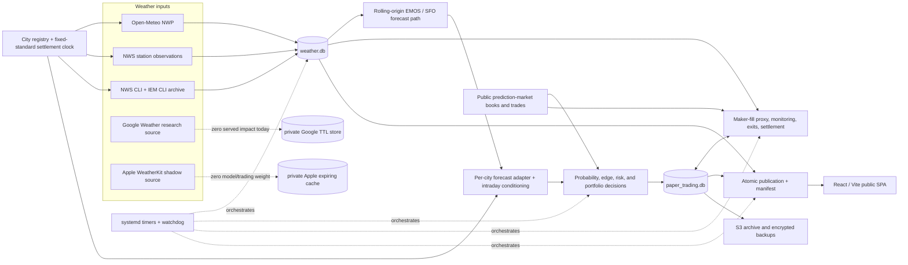

# WeatherEdge Codebase Walkthrough and Review Ledger

Research baseline: 2026-08-11, local Git revision
`a176972a25108fa1c5d948bd0cdc5710e1d4b99f` (`main`).

Re-baselined 2026-08-16 against `main` at
`2d6bacabe` (post PR #96/#97). Findings were spot-checked at that revision;
see the status column for entries resolved since the original baseline.

This is the durable map for learning, reviewing, and improving WeatherEdge one
part at a time. It describes the repository as the code exists at the research
baseline, records what was actually verified, and gives future chats a single
place to resume the walkthrough.

It is intentionally not a declaration that every open item is a bug. Items are
classified as confirmed defects, measurement gaps, design questions,
efficiency opportunities, documentation drift, or production rechecks. We will
decide them together.

## How to resume in a new chat

Give the new assistant this instruction:

> Read `AGENTS.md`, then `docs/SESSION_MEMORY.md`, then
> `docs/CODEBASE-WALKTHROUGH.md`, then
> `docs/CODEBASE-REVIEW-DIALOGUE.md`. Print the required dated Session Brief and
> verify current Git state. Resume the item marked **ACTIVE**, preserve every
> new question/answer/proposal in the dialogue file, and do not check an item
> off until the accepted batch is implemented, verified, and approved.

The startup order matters:

1. `AGENTS.md` defines safety and repository-specific rules.
2. [`SESSION_MEMORY.md`](SESSION_MEMORY.md) is the rolling operational handoff.
   Production facts there are dated snapshots, not guaranteed current state.
3. This document is the architecture map and checklist.
4. [`CODEBASE-REVIEW-DIALOGUE.md`](CODEBASE-REVIEW-DIALOGUE.md) preserves the
   owner's questions, alternatives, answers, and batch proposals.
5. Current Git, tests, AWS state, and public artifacts must be rechecked when a
   claim depends on them.

Line numbers below are navigation aids, not permanent identifiers. Search for
the named symbol when code movement makes a line reference stale.

## Working agreement for this walkthrough

- We discuss one gear at a time.
- I explain its purpose, inputs, transformation, output, safety boundaries,
  and current review candidates in plain language.
- You can answer **yes**, **no**, or **could we do this instead?**
- Every question, answer, objection, and suggestion is appended to
  [`CODEBASE-REVIEW-DIALOGUE.md`](CODEBASE-REVIEW-DIALOGUE.md).
- During the walkthrough we collect and refine proposals; we do not implement
  each proposal immediately.
- After all gears are reviewed, accepted proposals are assembled into one
  dependency-ordered implementation plan and implemented as a batch.
- A gear receives `[x]` only after its accepted batch changes are implemented,
  tested, and approved. Agreement on a future direction is recorded as
  **ACCEPTED FOR BATCH**, not as completion.
- Explaining an issue is not enough to close it. Hiding a symptom, clearing a
  failed-unit marker, or deferring work without recording why is not closure.
- Deliberate deferrals remain unchecked and are recorded in the decision log.
- The two paper accounts are economically separate. Their balances, returns,
  and evidence must never be summed as though they were one bankroll.
- No ignored local runtime file is used to diagnose production unless it was
  regenerated during the current task. Production authority is AWS-side after
  sync and refresh.

Status convention:

- `[ ]` open or not yet reviewed
- `[x]` accepted and verified
- **ACTIVE** the only item currently under discussion
- **RECHECK** a dated operational observation that needs current verification
- **DEFERRED** an intentional hold whose reason must remain documented

## Evidence legend

| Label | Meaning |
|---|---|
| **CODE-CONFIRMED** | The current code path directly demonstrates the behavior. It may not have been reproduced in production. |
| **TEST-VERIFIED** | A local command or focused test exercised the behavior. |
| **DATED SNAPSHOT** | Last known production/public state from `SESSION_MEMORY.md`; not a current claim. |
| **DESIGN QUESTION** | The behavior may be intentional; owner intent is needed. |
| **MEASUREMENT GAP** | The system lacks evidence needed to judge correctness or performance. |
| **EFFICIENCY** | A maintainability, runtime, dependency, or workflow improvement, not necessarily a defect. |
| **EXTERNALLY VERIFIED** | Checked against a current primary public source on the research date. |

## Current baseline

### Repository state and local verification

At the research baseline, `main` matched `origin/main` and the worktree was
clean before this document was added.

| Measure | Observed value |
|---|---:|
| Tracked files | 558 |
| Python files | 277 |
| TypeScript/TSX files | 116 |
| Markdown files | 49 before this document |
| Python test files | 135 |
| Frontend test files | 38 |
| Python test functions discovered by source scan | 2,107 |
| systemd timer definitions | 14 |

Fresh verification performed for this research:

- `bash scripts/run_tests.sh`: **2,721 passed, 8 skipped** (re-verified
  2026-08-16 at the re-baseline revision; 2,623 at the original baseline).
- `bun run test`: **38 files, 166 tests passed** (re-verified 2026-08-16;
  165 at the original baseline).
- `bun run lint`: exit 0 with two Fast Refresh warnings in
  `src/components/overview/CityGrid.tsx`.
- `bun run build`: passed.
- `bun run bundle:report`: initial JS 219.48 KiB against a 300 KiB target; CSS
  16.91 KiB against a 40 KiB target.

These results verify the current automated suite, not the absence of logic,
modeling, operational, or contract defects.

### Last known production snapshot

The following is a **DATED SNAPSHOT**, last verified 2026-08-10 in
[`SESSION_MEMORY.md`](SESSION_MEMORY.md):

- Production was healthy and paper-only at runtime revision
  `10b4844dd28e1008789dab5846b67e07bfeabc0c`; live real-money execution was
  disabled.
- Apple WeatherKit was active for all 15 stations at four UTC vintages, with
  exactly zero trading weight and private, provider-expiring storage only.
- Fourteen canonical timers were enabled: thirteen application timers plus the
  scheduler watchdog.
- The two active paper ledgers remained economically separate.
- Two pre-deployment failures remained unresolved at the root-cause level: a
  second IEM HTTP 503 in the dataset job and a retention job that exceeded its
  one-hour prune deadline after archive and foreign-key checks passed.
- A later public-manifest HTTP 503 recovered without a code or policy change;
  recurrence remains a reliability concern rather than a fixed WeatherEdge
  defect.

Do not repeat those bullets as current production facts without an AWS/public
recheck.

## The system in one sentence

WeatherEdge turns multi-source weather forecasts into calibrated daily-high
temperature probabilities for 15 city prediction markets, applies fee,
liquidity, and risk gates, records simulated orders in isolated paper accounts,
settles them from official NWS climate reports, and publishes a versioned
read-only dashboard.

## Whole-system flow

The dashed Google and Apple branches are important. Google currently has a
paid, temporary research acquisition path but no tracked production caller that
turns the expiring values into durable paired evidence. Apple is deliberately
more isolated: it must not enter training, `weather.db`, trading decisions,
public JSON, or logs under the current provider boundary.

## Repository atlas

| Area | Responsibility | Main entry points |
|---|---|---|
| `forecaster/` | City registry, weather ingestion, truth, NWP archive, EMOS, SFO research models, private provider caches | `city_truth.py`, `nwp_archive.py`, `emos_forecast.py`, `google_multicity_refresh.py`, `apple_weatherkit.py` |
| `forecaster/research/` | Offline SFO training, comparison, climatology, and static dashboard fixtures | `lstm_model.py`, `compare_models.py`, `forecast_tomorrow.py`, `eda.py` |
| `trading/sfo_kalshi_quant/` | Market reads, probability engine, risk, portfolio allocation, paper execution, settlement, research, publication | `cli.py` and its `_cli/` command modules |
| `trading/sfo_kalshi_quant/store/` | Extracted schema, scoring, and diagnostics helpers behind the `PaperStore` facade | `schema.py`, `scoring.py`, `diagnostics.py` |
| `trading/deploy/aws/` | Installation, service units, publication, backup, retention, health, and deployment verification | shell scripts, `systemd/`, `verify_trading_install.py` |
| `src/` | React SPA: Overview, Methodology, Strategy Lab, publication freshness, tolerant selectors | `main.tsx`, `App.tsx`, `lib/data.ts`, `lib/strategy.ts`, `lib/publication.tsx` |
| `public/` | Tracked fallback/static artifacts for local builds, not recurring production authority | JSON fixtures and static assets |
| `scripts/` | Local verification, runtime cleanup, bundle reporting, resource capture, generated icons | `verify_project.sh`, `clear_local_runtime_state.py`, bundle/icon scripts |
| `.github/workflows/` | Python/web CI and Pages-facing automation | `verify.yml` |
| `docs/` | Architecture, operations, audits, policy, experiments, and cross-session memory | `SESSION_MEMORY.md`, this ledger, deployment and audit documents |
| `pyproject.toml` | Packages only `trading/sfo_kalshi_quant`; exposes `sfo-kalshi` | Python project metadata |
| `package.json` | Bun/Vite/React commands and web dependency graph | `dev`, `test`, `lint`, `build`, bundle scripts |

## Runtime authority and persistence

| Data | Authority | Durability | Main consumers |
|---|---|---|---|
| City/station/series identity | `forecaster/cities.py` and byte-identical trading copy | Tracked source | Every per-city pipeline stage |
| Final settlement truth | AWS `weather.db.cli_settlements` with `is_final=1` | Durable SQLite | Model scoring and paper settlement |
| Raw/running NWS observations | AWS `weather.db` observation tables | Durable SQLite | Intraday conditioning; never equivalent to final CLI truth |
| NWP and EMOS history | AWS `weather.db` | Durable SQLite | Live serve, calibration, scorecards |
| Paper decisions/orders/ledgers/research | AWS `paper_trading.db` | Durable SQLite plus archive/backup | Scan, monitor, settlement, Strategy Lab |
| Google temperatures | Private mode-0600 runtime SQLite | TTL/provider-limited | Research challenger only |
| Google request-usage ledger | `weather.db` | Durable metadata only | Budget enforcement and audit |
| Apple values | Private mode-0600 runtime JSON/tmpfs | Provider-expiring | Shadow availability checks only |
| Public dashboard snapshot | AWS-built JSON plus `publication_manifest.json`, then GitHub Pages | Replaced per publish; manifest-versioned | Browser SPA |
| Tracked `public/*.json` and forecaster JSON | Repository fixtures | Durable but potentially stale | Local build/fallback/manual research |
| Ignored local DB/cache/artifacts | Local workstation | Disposable | Never production authority unless regenerated now |

### `weather.db`

The forecaster database owns station observations, observation-derived daily
highs, final CLI settlements, NWP model forecasts, rolling/live EMOS Gaussian
forecasts, legacy SFO blend archives, and provider usage metadata. Apple values
must never appear here. Google temperature content belongs in the private TTL
store; only usage metadata and policy-approved derived evidence may be durable.

### `paper_trading.db`

The trading database owns schema migrations; forecast, market, order-book,
probability, scan, and decision snapshots; paper orders; maker allocations and
claims; settlements; account ledgers; strategy versions; monitor snapshots;
and Strategy Lab goals, plans, experiments, shadows, and evidence. The
`PaperStore` facade in `trading/sfo_kalshi_quant/db.py` is currently 6,533 lines
despite partial extraction into `store/`.

## External systems

| System | What is read or written | Authentication/state boundary |
|---|---|---|
| NWS `api.weather.gov` and forecast product service | Station observations and official CLI products | Public read; explicit user agent |
| Iowa Environmental Mesonet | Historical ASOS/CLI truth and command-line datasets | Public read; upstream 5xx handling matters |
| Open-Meteo current, previous-runs, ensemble, and archive APIs | Multi-model hourly/daily forecast inputs | Public read; coverage and cycle identity matter |
| NOAA NCEI/NOMADS | Historical/research weather datasets | Public read; mainly backfill/research paths |
| Google Weather | Paid current/hourly/daily research data | Budgeted request ledger; content kept in private TTL storage |
| Apple WeatherKit | Temporary all-city shadow forecasts | ES256 in memory; redirect refusal; provider-expiring private cache; zero weight |
| Prediction-market public API | Events, bracket markets, order books, and public trades | Unauthenticated read path only; live order client intentionally absent |
| GitHub/GitHub Pages | Source/CI and published static dashboard branch | Publisher promotes a coherent manifest-stamped snapshot |
| AWS EC2/systemd/S3 | Runtime processes, durable SQLite, archives, backups | Operator-only; sensitive details stay in ignored local state |
| Optional alert webhook | Sanitized systemd failure notices | Secret must not enter tracked docs or logs |

## Scheduled machinery

The repository defines 14 timers. This is a code map, not proof that every
timer is currently enabled or healthy.

| Timer gear | Repository cadence/purpose |
|---|---|
| Dataset backfill | Nightly at 10:01 UTC; non-persistent; datasets, truth archive, NWP, EMOS rebuild |
| Forecast freshness | At minutes 15 and 45; checks live forecast age |
| Forecaster refresh | Twice hourly during the active window and hourly overnight |
| Paper monitor | Every 2 minutes; fills, marks, exits, and order expiry |
| Paper retention | Daily at 08:20 UTC; non-persistent; archive then prune with a one-hour service deadline |
| Paper scan | Every 5 minutes; all-city/profile decision and paper placement cycle |
| Paper settle | Every 30 minutes; final CLI settlement after grace rules |
| Operational publish | Five minutes after the previous completion; fast dashboard artifacts |
| Scheduler health | Offset five-minute watchdog of units, freshness, disk, and publication |
| Strategy Lab | Wall-clock every 5 minutes; research/accounting artifact |
| Apple purge | Every 10 minutes |
| Apple refresh | Four fixed UTC vintages daily |
| Non-SFO Google refresh | Daily |
| Google purge | Every 10 minutes |

Primary definitions live under `trading/deploy/aws/systemd/`; orchestration
scripts live one directory above them.

## Gear-by-gear map

### G00 — Mission, authority, and safety contract — **REVIEWED / BATCH PENDING**

**Purpose:** define what the system is allowed to claim and do before reviewing
implementation details.

- The project is research and paper trading only.
- The public market API is read-only; `live_execution.py` fails closed and has
  no authenticated live-order client.
- The two active paper accounts are economically separate.
- Official final NWS CLI truth settles positions; raw observations do not.
- SFO is the flagship evidence base; the other 14 cities have a shorter
  operational history and should not inherit SFO claims automatically.
- Apple currently has zero model/trading weight and a strict non-durable
  boundary. The owner has directed that the later batch give Apple a genuine
  path into the combined forecast to improve accuracy. D001-D002 in the review
  dialogue record that accepted direction; exact weight, uncertainty handling,
  evidence, and rollout remain open design work.
- AWS-generated data is production authority after sync; ignored local state is
  disposable.

**Anchors:** `README.md`, `AGENTS.md`, `docs/SESSION_MEMORY.md`,
`trading/sfo_kalshi_quant/live_execution.py`, `docs/APPLE-WEATHERKIT.md`.

**Decision to confirm:** Is this the intended operating contract, or should any
claim/boundary change before we review code behavior?

### G01 — City registry and settlement clock — **REVIEWED / BATCH PENDING**

**Purpose:** make every source, forecast, market, and settlement refer to the
same city and climate day.

**Flow:** 15 registry entries define slug, city, market series, NWS station,
CLI site/issuer, coordinates, civil timezone, and fixed-standard UTC offset.
The settlement calendar maps timestamps into midnight-to-midnight local
standard-time days and rounds official reported highs.

**Anchors:** `forecaster/cities.py:32-239`,
`trading/sfo_kalshi_quant/cities.py`,
`forecaster/settlement_calendar.py:10-55`,
`trading/sfo_kalshi_quant/settlement_day.py`.

**Invariants:** station and series identity are series-scoped; DST must not move
the settlement window; the two Python registries are byte-identical and guarded
by `trading/tests/test_cities_parity.py`.

**Review focus:** deliberate registry duplication now extends into related
frontend and account region maps. D003 in the dialogue recommends one canonical
declarative schema with deterministic, deployment-local generated copies.

### G02 — Settlement truth and intraday observations — **ACTIVE**

**Purpose:** distinguish the running temperature from the value that officially
settles a market.

**Flow:** NWS station observations build a running high. Live NWS CLI and IEM
CLI backfill populate `cli_settlements`; final rows cannot be overwritten by
preliminary rows. The trading adapter loads both and conditions probabilities
on what is known so far.

**Anchors:** `forecaster/clisfo.py:54-137`,
`forecaster/city_truth.py:46-307`,
`forecaster/nws_ground_truth.py:93-336`,
`trading/sfo_kalshi_quant/forecast.py:194-324`,
`trading/sfo_kalshi_quant/probability.py:346-387`.

**Invariants:** only durable `cli_settlements.is_final=1` is exact settlement
truth; preliminary `AS OF` products and raw station maxima remain uncertain.

**Review focus:** R01, R22, R29.

### G03 — Weather providers and private runtime caches

**Purpose:** acquire forecast inputs without violating provider, budget, or
data-boundary rules.

**Flow:** Open-Meteo supplies the main NWP path. Google writes usage metadata
durably but temperature content to a private TTL database. Apple writes only a
private expiring cache. NWS supplies public observations and truth.

**Anchors:** `forecaster/nwp_archive.py`, `forecaster/google_api.py`,
`forecaster/google_weather_store.py`,
`forecaster/google_multicity_refresh.py`,
`forecaster/apple_weatherkit.py`, `forecaster/weather_cache_config.py`.

**Invariants:** credentials and provider content never leak to public JSON or
logs; paid calls are reserved before dispatch; each city fails independently;
Google/Apple station-day highs require the exact fixed-standard window.

**Review focus:** R20, R24, R30, plus whether the current Google spend has a
useful evidence output before TTL expiry.

### G04 — NWP archive, EMOS fitting, and live serve

**Purpose:** convert eight raw model members into a calibrated Gaussian daily
high forecast for each city.

**Flow:** leakage-safe Open-Meteo previous-runs hourly fields become
fixed-standard daily maxima in `nwp_model_forecasts`. Rolling-origin EMOS fits
per-model bias, optional inverse-error weights, an OLS mean, and variance from
cross-model spread. Live current-run members are served as `(mu, sigma)` for
today through two days ahead.

**Anchors:** `forecaster/nwp_archive.py:45-449`,
`forecaster/postproc_models.py:44-231`,
`forecaster/emos_forecast.py:64-489`,
`forecaster/emos_recalibration.py:80-247`.

**Invariants:** rolling-origin v2 wins exclusively over v1 within a compatible
scope; final truth must respect lead availability; a city should not silently
appear healthy with insufficient model coverage.

**Review focus:** R02, R05, R07, R17-R21, R23.

### G05 — SFO-specific blend, residual calibration, and challengers

**Purpose:** preserve the deeper SFO research stack while giving the other 14
cities a station-agnostic EMOS path.

**Flow:** the legacy SFO path can blend Google, NWS, Open-Meteo, and history,
then apply LSTM residual and marine-layer research. When that blend is stale,
the trading adapter can fall back to live EMOS for the point forecast. Research
profiles can enable an EMOS distribution separately.

**Anchors:** `forecaster/blend_sources.py`, `blend_learners.py`,
`blend_archive.py`, `forecaster/research/`,
`trading/sfo_kalshi_quant/forecast.py:112-192`,
`trading/sfo_kalshi_quant/config.py:220-228,616-620,691-708`.

**Invariants:** SFO-only evidence is not generalized to all cities; a fallback
mean and its uncertainty distribution must describe the same predictive object.

**Review focus:** R03, R04-R07, R24, R25, R30.

### G06 — Forecast adapter, brackets, and probability engine

**Purpose:** translate a city forecast and intraday state into probabilities
over the exact market brackets.

**Flow:** the adapter selects a per-city forecast, residual calibration
outcomes, optional EMOS distribution, observed-high state, and ensembles.
`standard_bins.py`/market metadata define intervals. `ResidualCalibrator`
combines empirical and Gaussian probabilities, applies intraday feasibility,
and normalizes the ladder.

**Anchors:** `trading/sfo_kalshi_quant/forecast.py`, `probability.py`,
`standard_bins.py`, `models.py`, `consensus.py`, `ensemble.py`.

**Invariants:** YES/NO views describe one logical outcome distribution;
non-final observations cannot create false 0/1 certainty; all bracket mass must
remain interpretable after conditioning.

**Review focus:** R01, R06, R07, R26 and lower-confidence-bound behavior.

### G07 — Public market data and order-book capture

**Purpose:** read events, brackets, books, and public trades without an order
credential path.

**Flow:** `KalshiPublicClient` (the internal historical class name) discovers
events and market snapshots; book/tape observations feed consensus, liquidity,
maker-fill evidence, and append-only captures.

**Anchors:** `trading/sfo_kalshi_quant/kalshi.py`, `orderbook_capture.py`,
`clv.py`, `models.py`, `_cli/scan.py:305-427`.

**Invariants:** reads may fail without authorizing live writes; market ticker,
series, target day, and bracket bounds must agree before a decision can settle.

**Review focus:** R12, R14, R15, R27.

### G08 — Edge, fees, risk, sizing, and portfolio allocation

**Purpose:** decide whether a model-market difference is tradeable after real
frictions and portfolio constraints.

**Flow:** both sides are evaluated in a common YES frame. Fee, spread,
confidence, forecast-cohort, liquidity, time, and uncertainty gates filter
candidates. Kelly/posterior sizing and joint portfolio constraints allocate the
paper budget.

**Anchors:** `fees.py`, `risk.py`, `joint_kelly.py`, `posterior_kelly.py`,
`portfolio.py`, `_cli/scan.py:186-427,814-990`.

**Invariants:** fee units and rounding match the effective market schedule;
paper-account equity never crosses account boundaries; exposure and budget caps
are enforced before placement.

**Review focus:** R06, R08, R11, R13, R26.

### G09 — Paper placement and maker-fill model

**Purpose:** simulate admission and execution without pretending a public book
provides private queue position.

**Flow:** `PaperTrader` enforces pause, bankroll, exposure, re-entry, depth, and
account rules. It records maker-first reservations or configured taker crosses.
The monitor claims a resting maker fill only from provable public-tape/book
conditions.

**Anchors:** `paper.py:588-736`, `execution.py`,
`maker_fills.py:186-368`, `logical_positions.py`, `db.py`.

**Invariants:** every order is paper-only; reservations cannot double-spend;
the proxy fill model is labeled as a proxy and must not imply real queue fills.

**Review focus:** R09, R14 and fill/ladder realism as more tape evidence grows.

### G10 — Monitoring, exits, settlement, and accounting

**Purpose:** keep pending/open paper positions marked and close them from
explicit exit rules or official final truth.

**Flow:** the two-minute monitor expires requests, checks fills, marks open
positions, refreshes model reads, and applies exits. Auto-settlement waits for a
final CLI row and the fixed-standard grace window. Account ledgers and
restatement tools preserve attribution.

**Anchors:** `monitor.py:316-654`, `exits.py`, `settlement.py`,
`settlement_truth.py`, `_cli/paper.py:392-500`, `account.py`, `restatement.py`.

**Invariants:** settlement is city/series scoped; final truth is durable;
economically separate accounts stay separate in balance, P&L, exposure, and
reporting.

**Review focus:** R09-R11, R14, R15.

### G11 — Scoring, replay, Strategy Lab, and promotion gates

**Purpose:** measure forecast and strategy quality without using future
information, then keep experiments separate from active profiles.

**Flow:** forecast scorecards join archived predictions to final CLI truth.
Replays reconstruct decisions and economics. Strategy Lab builds per-account
standing, calibration, readiness, goals, experiments, shadows, and promotion
proposals for the public research artifact.

**Anchors:** `forecast_scorecards.py`, `backtest.py`, `backtest_rescore.py`,
`research_scoring.py`, `research_operate.py`, `research_promotion.py`,
`strategy_lab/`, `strategy_research.py`.

**Invariants:** forecast-time information only; served objects are scored as
served; evidence and gates use the same cohort definitions; promotion remains
explicit and fail-closed.

**Review focus:** R04-R06, R12, R16, R17, R26.

### G12 — Database health, retention, archives, and backups

**Purpose:** keep append-only research evidence bounded, recoverable, and
auditable.

**Flow:** archive eligibility and foreign-key gates run before batched pruning;
daily archive manifests and encrypted off-host backups are verified before
destructive maintenance or deployment proceeds.

**Anchors:** `archive.py`, `db.py:5972-6254`, `store/schema.py:577-648`,
`trading/deploy/aws/run_archive_then_prune.sh`, `compact_paper_db.sh`,
`backup_paper_db.sh`.

**Invariants:** never prune unarchived evidence; verify download/checksum,
SQLite integrity, and foreign keys; retain account and strategy lineage.

**Review focus:** R21, R28 and the dated one-hour prune failure.

### G13 — Publication transaction and public artifacts

**Purpose:** prevent the browser from mixing files from different publication
cycles.

**Flow:** fast and Strategy Lab producers write candidate JSON files. The
publication module validates objects/timestamps, scans forbidden raw Google
content, hashes artifacts, stamps a snapshot manifest, promotes atomically,
and publishes the built SPA plus data to GitHub Pages.

**Required fast artifacts:** `trading_signal.json`, `forecast_data.json`,
`weather_story_data.json`, `cities_data.json`.

**Optional/preserved artifact:** `strategy_research.json`.

**Anchors:** `publication.py:17-37,131-139,221-347`, `report.py`,
`cities_report.py`, `strategy_lab/build.py`,
`trading/deploy/aws/run_publication_cycle.sh`,
`publish_forecaster_pages.sh`.

**Invariants:** one snapshot ID/hash set; strategy may be preserved/missing
without corrupting fast publication; source provenance and freshness are
explicit; private provider content cannot pass validation.

**Review focus:** R08, R31-R35, R42.

### G14 — React dashboard

**Purpose:** explain forecasts, markets, paper evidence, and operational
freshness without implying real-money execution or unsupported certainty.

**Flow:** `PublicationProvider` polls the manifest and versions artifact URLs.
`App` hash-routes to Overview, Methodology, or Strategy Lab. Data selectors use
tolerant defaults; components hide current-state claims when publication is
stale or accounting is unavailable.

**Anchors:** `src/main.tsx`, `src/App.tsx`, `src/lib/publication.tsx`,
`src/lib/data.ts`, `src/lib/strategy.ts`, `src/components/views/`.

**Strengths:** route/code splitting, pre-paint theme, keyboard focus handling,
offline icons, stale-data banners, route-level error boundaries, and bundle
budgets.

**Review focus:** R08, R31-R39.

### G15 — Scheduling, deployment, health, and security

**Purpose:** turn scripts into a recoverable, observable, paper-only AWS
runtime.

**Flow:** install/sync scripts resolve runtime paths and templates; systemd
timers run forecasting, scanning, monitoring, settlement, retention, and
publication; watchdog checks units, freshness, disk, and manifest; deploys use
maintenance mode and verified backup gates.

**Anchors:** `trading/deploy/aws/README.md`, `install_systemd*.sh`,
`systemd/`, `check_scheduler_health.sh`, `verify_systemd_unit_integrity.sh`,
`verify_trading_install.py`, `docs/aws_deployment.md`.

**Invariants:** live execution stays disabled; credentials/sensitive
infrastructure values stay outside tracked docs; failed jobs remain visible
until evidence is captured; deployment never bypasses recoverability gates.

**Review focus:** R02, R22, R28, R40, R46 and both dated nightly failures.

### G16 — Tests, CI, documentation, and dependency hygiene

**Purpose:** make correctness and architecture drift detectable before merge
and understandable afterward.

**Flow:** pytest covers forecaster/trading; Vitest covers data/UI behavior;
oxlint checks web code; TypeScript/Vite build the SPA; Python compile,
Semgrep, health checks, and CI bundle capture provide additional gates.

**Anchors:** `scripts/run_tests.sh`, `scripts/verify_project.sh`,
`.github/workflows/verify.yml`, `package.json`, `pyproject.toml`, `docs/`.

**Invariants:** documented counts and production claims are dated; fork PR
coverage limitations are visible; local and CI verification scopes are not
described as identical.

**Review focus:** R03, R25, R36-R40 plus large-module ownership.

## Review register

This register is the triage map. The gear checklist is the walkthrough order;
the priority column says what should be fixed first once its owning gear is
under discussion.

| ID | Priority | Classification | Current finding | Primary gear |
|---|---|---|---|---|
| R01 | P0 | **CODE-CONFIRMED correctness defect** | An observation-derived high is marked complete merely because its day is in the past; the adapter treats that as final, allowing hard-zero/point-mass probabilities even though only final CLI truth should be exact. | G02/G06 |
| R02 | P0 | **CODE-CONFIRMED reliability defect** | The all-city EMOS baseline subprocess can be swallowed, zero served rows can still return success, and scheduled forecaster/dataset commands are prefixed to ignore failure. | G04/G15 |
| R03 | P0 | **RESOLVED 2026-08-16** | `forecaster/research/forecast_tomorrow.py` used `math.sqrt` without importing `math`. Fixed on `main` (the module now imports `math` at line 4); the defect was real at the 2026-08-11 baseline and is closed at the re-baseline revision. | G05/G16 |
| R04 | P1 | **MEASUREMENT GAP** | Scorecards explicitly exclude `source='live'`; no job scores the exact final served probability ladder/distribution against final truth. | G05/G11 |
| R05 | P1 | **CODE-CONFIRMED model-validity defect** | Parts of forecaster Brier/calibration evaluation choose a sigma cohort from the actual settled high, then reuse those labels for forecast-time readiness. ROI replay was partly corrected, but the core outcome-conditioned calibration remains. | G04/G11 |
| R06 | P1 | **CODE-CONFIRMED semantic defect** | `source_spread_f` is a raw model/source range with different meanings across paths, yet scan/rescore pass it as `forecast_sigma_f` and a comfort gate treats it like standard deviation. | G06/G08 |
| R07 | P1 | **DESIGN/CORRECTNESS QUESTION** | SFO can fall back to an EMOS mean while the base live profile keeps the legacy residual distribution because EMOS distribution mode is off. Mean and uncertainty can describe different predictive objects. | G04-G06 |
| R08 | P1 | **CODE-CONFIRMED public contract drift** | `cities_data.json` publishes pre/post-intraday fields, but the frontend omits them and can label the adjusted high beside pre-adjustment sigma; its cross-artifact heuristic no longer detects the adjustment. | G13/G14 |
| R09 | P1 | **CODE-CONFIRMED execution-order question** | Monitor ordering expires requests before inspecting the latest tape. Determine whether evidence arriving at the expiry boundary can be incorrectly discarded. | G09/G10 |
| R10 | P1 | **CODE-CONFIRMED accounting gap** | Auto-settlement has no independent vendor-settlement reconciliation, and mismatch reporting can exit successfully. Define whether official CLI alone is the intended authority and how discrepancies should fail. | G10 |
| R11 | P1 | **CODE-CONFIRMED account-isolation defect** | Live-equity sizing calls `paper_equity` with a profile but not an account ID, although the store supports both. Archived P&L carrying the same profile can enter the sizing base; placement caps limit damage but do not correct the input. | G08/G10 |
| R12 | P1 | **CODE-CONFIRMED measurement gap** | CLV selection is target-date scoped across ledgers and its loader path lacks integration coverage; it may not preserve account/profile attribution. | G07/G11 |
| R13 | P1 | **CODE-CONFIRMED research-label defect** | The “after-cost market backtest” gate counts raw trade rows and always remains `collect_only`; it does not compute after-cost economics. The fail-closed outcome is safe, but the label/measurement is incomplete. | G08/G11 |
| R14 | P1 | **CODE-CONFIRMED orchestration defect** | Analyze/portfolio commands can return exit 0 after every city/target was skipped, allowing a scheduled scan to look successful with zero analyzable targets. | G07/G09/G15 |
| R15 | P1 | **CODE-CONFIRMED data-quality gap** | NWP daily maxima can be built from partial hourly coverage, unlike the exact-24-hour Google/Apple validators. | G04 |
| R16 | P1 | **CODE-CONFIRMED archive gap** | NWP storage records fetch time but not the model initialization/cycle needed to prove which run informed a decision. | G04/G11 |
| R17 | P1 | **CODE-CONFIRMED evidence gap** | Live EMOS rows are last-write-wins because the primary key excludes fetch time. Trading snapshots preserve decisions, but forecaster-side intraday forecast revisions cannot be studied directly. | G04/G12 |
| R18 | P1 | **MODEL-VALIDITY QUESTION** | Historical training uses previous-runs fields while live serve uses current-run members; code acknowledges the mismatch, but no comparable live-vintage archive validates the correction. | G04/G11 |
| R19 | P2 | **EFFICIENCY** | Rolling EMOS refits repeatedly across targets/cities and appears roughly quadratic over history; lead-0/lead-1 work can be duplicated. Cache a fit per station/lead/cycle before larger rewrites. | G04 |
| R20 | P2 | **COST/EVIDENCE QUESTION** | The paid Google pipeline stores expiring content, but no non-test tracked caller writes the allowed durable paired evidence before purge. Decide: wire a preregistered study, reduce cadence, or decommission. | G03/G05 |
| R21 | P1 | **DATED SNAPSHOT + CODE GROWTH DEBT** | The 2026-08-10 retention run passed archive/FK gates then exceeded 3,600 seconds during pruning. Old anti-join defects were fixed, but archive gating still walks from journal genesis and the current root cause is unknown. | G12/G15 |
| R22 | P1 | **DATED SNAPSHOT + reliability debt** | The dataset job reached a second IEM 503. IEM work repeats old years and relies more on cross-night thresholds than bounded within-run 5xx retry/backoff. | G02/G15 |
| R23 | P1 | **MODEL-VALIDITY defect/question** | One postprocessing backtest omits the lead-day truth lag and is SFO-defaulted, risking unavailable truth in training and weak multi-city comparability. | G04/G11 |
| R24 | P2 | **ARCHITECTURE** | The scheduled `--cities` Google route makes much of the legacy blend stack dormant while a dynamic compatibility facade obscures ownership. Decide to restore, isolate, or retire it. | G03/G05 |
| R25 | P2 | **DOCUMENTATION drift** | README says 132 Python test files while Git tracks 135; `docs/APPLE-WEATHERKIT.md` says “not deployed” while the dated Session Memory says it was deployed; Python/web package versions also differ. | G16 |
| R26 | P1 | **CODE-CONFIRMED mathematical defects** | The probability lower-bound path has three coupled problems: falling back to global residuals defeats the intended conditional-sample cap, binomial standard error is applied to a blended model/market posterior, and the NO lower bound is derived from an already floor-clipped YES bound. Review and fix them as one safety change. | G06/G08 |
| R27 | P2 | **MEASUREMENT/attribution** | Public-market and CLV research needs stronger series/account/profile scoping and loader-level tests before it supports edge claims. | G07/G11 |
| R28 | P2 | **EFFICIENCY/reliability** | Retention scans still grow with history; a runner comment says 1,800 seconds while the service deadline is 3,600 seconds. | G12/G15 |
| R29 | P2 | **PARSER robustness** | CLI parsing anchors to the temperature section but can fall back to a global MAX search. Add real final/preliminary fixtures across all 15 forecast offices, then narrow the fallback. | G02 |
| R30 | P2 | **ARCHITECTURE** | The two Python city registries are intentionally copied; the frontend and account layer maintain additional related maps. Generation from one schema could reduce coordinated edits. | G01/G03 |
| R31 | P1 | **CODE-CONFIRMED schema weakness** | Browser payload “types” are unchecked casts; the publisher validates object/hash/timestamp coherence but not field schemas. A second drift already exists: monthly temperatures are typed as a record while the producer emits an array. | G13/G14 |
| R32 | P1 | **CODE-CONFIRMED retry defect** | A failed artifact request is deleted from the shared cache but is not retried at the same manifest version until remount or a new snapshot. | G13/G14 |
| R33 | P1 | **CODE-CONFIRMED availability defect** | The initial manifest fetch has no timeout; a hung request leaves `manifestSettled=false` and blocks all artifact loading indefinitely. | G13/G14 |
| R34 | P2 | **ARCHITECTURE/UX** | `App` always loads three dashboard artifacts even on Strategy Lab; one `Promise.all` failure blocks unrelated data and the overview waits for methodology-oriented story data. | G14 |
| R35 | P2 | **CODE-CONFIRMED UX** | A manifest-declared missing optional Strategy Lab artifact is still fetched, causing an avoidable 404/generic error. | G13/G14 |
| R36 | P2 | **CODE-CONFIRMED UI state bug** | When SFO target dates shrink, the display falls back to the first target but the segment control can retain an invalid selected key. | G14 |
| R37 | P2 | **DEPENDENCY hygiene** | Twenty-one direct web packages have no repository source import; some may be HeroUI peers and need small-batch removal tests. `tw-animate-css` has the inverse problem: directly imported but only transitively installed. | G14/G16 |
| R38 | P2 | **CI coverage gap** | CI browser capture measures initial resources but does not drive routes, controls, responsive layouts, focus, or fresh/stale states. Fork PR web coverage is also constrained by the licensed UI dependency secret. | G14/G16 |
| R39 | P3 | **LINT debt** | Two helper exports in `CityGrid.tsx` trigger `react(only-export-components)` warnings; extract them to a non-component module with tests. | G14/G16 |
| R40 | P2 | **MAINTAINABILITY** | `PaperStore` remains a 6,533-line facade and `src/lib/strategy.ts` is 870 lines. Extraction should follow bounded domains and preserve facade tests, not be a cosmetic rewrite. | G10-G16 |
| R41 | P2 | **CODE-CONFIRMED research/docs fee drift** | Series-aware production pricing correctly gives unlisted weather series a zero maker multiplier, but `edge_scan.py` omits the series and still labels maker cost as 25% of taker; `docs/architecture.md` repeats that outdated statement. | G07/G08/G16 |
| R42 | P1 | **FRESHNESS contract question** | All four fast artifacts are required for publication, but only `trading_signal.json` and `cities_data.json` participate in operational freshness enforcement. Decide whether static/manual forecast/story artifacts should be required, independently versioned, or aged too. | G13/G14 |
| R43 | P2 | **EFFICIENCY** | Every `PaperStore` construction re-enters schema, trigger, migration, and account setup. Frequent scheduled processes pay this startup cost and concentrate unrelated ownership in the store facade. | G10/G12/G16 |
| R44 | P2 | **MEASUREMENT GAP** | City/region exposure caps are hand-assigned; no estimated cross-city forecast-residual correlation matrix supports the diversification assumptions. | G08/G11 |
| R45 | P2 | **MODEL GENERALIZATION GAP** | Intraday remaining-heat behavior uses one global climatological schedule. City configuration changes timezone but does not supply learned city-specific intraday behavior. | G02/G06/G11 |
| R46 | P2 | **OPERATIONS DESIGN GAP** | The watchdog checks other timers but cannot detect that its own timer was disabled. A truly independent public/external canary is needed for that failure class. | G15 |

## High-impact dated-audit reconciliation

Older audit documents are useful evidence, but they are not live issue lists.
There have been substantial changes since their audited revisions. The
following claims were rechecked against the current baseline:

| Older claim | Baseline status | Evidence |
|---|---|---|
| YES and NO sides could double-count one logical signal | **Resolved in current code** | Complement collapse in `store/scoring.py:303-360,426-488`; summary converts both sides to a YES frame in `summary.py:871-974`. |
| Fee rounding/default maker semantics needed external confirmation | **Resolved for the series-aware production path on the 2026-07-07 schedule** | Code uses 0.0001 balance precision and default maker multiplier zero; verified against the [official fee schedule](https://kalshi.com/docs/kalshi-fee-schedule.pdf) and [fee-rounding documentation](https://docs.kalshi.com/getting_started/fee_rounding). The generic edge-scan/docs path is still stale (R41), and automated schedule freshness remains a separate design choice. |
| Retention used unbounded anti-joins without supporting indexes | **Implementation fixed; operational recurrence not resolved** | Ten retention indexes plus bounded correlated `EXISTS`, per-batch commits, and adaptive batching now exist. The 2026-08-10 timeout occurred later and requires current runtime evidence. |
| Economics replay used settled cohorts for ROI gating | **Partly resolved** | Current ROI replay scopes checks by forecast cohort, but the predictive-distribution calibration still selects/buckets from actual outcome cohorts (R05). |
| Served distribution had no feedback loop | **Still open** | Non-live EMOS scorecards improved, but exact live/final served probability objects are still not scored (R04). |
| “After-cost” gate established tradable economics | **Still open, safely fail-closed** | It counts rows and reports `collect_only`; it cannot promote automatically (R13). |

## Strengths worth preserving

- Live execution is structurally absent/fail-closed rather than controlled by a
  hopeful flag alone.
- Final CLI settlement truth is station-keyed and prevents preliminary
  overwrites.
- Rolling-origin v2 selection avoids mixing incompatible v1/v2 rows within a
  scope.
- Apple and Google content boundaries are explicit and extensively tested.
- The paper journal records unusually rich forecast, probability, book,
  decision, maker, settlement, research, and lineage evidence.
- YES/NO complement collapse now avoids systemic logical double-counting.
- Publication uses hashes, freshness timestamps, source provenance, and a
  manifest so the browser can request a coherent snapshot.
- The frontend fails closed for stale market/accounting state and has strong
  keyboard, focus, theme, lazy-loading, and bundle-budget behavior.
- Retention and deployment use archive, foreign-key, integrity, checksum, and
  recoverability gates.
- The local suite is broad and currently green; model and architecture gaps are
  still called out instead of being hidden behind test counts.

## Walkthrough checklist

Only one item is active. Do not pre-check later items because their tests pass.

- [ ] **G00 — Mission, authority, and safety contract — REVIEWED / ACCEPTED FOR BATCH**
- [ ] **G01 — City registry and settlement clock — REVIEWED / ACCEPTED FOR BATCH**
- [ ] **G02 — Settlement truth and intraday observations — ACTIVE**
- [ ] **G03 — Weather providers and private runtime caches**
- [ ] **G04 — NWP archive, EMOS fitting, and live serve**
- [ ] **G05 — SFO-specific blend, residual calibration, and challengers**
- [ ] **G06 — Forecast adapter, brackets, and probability engine**
- [ ] **G07 — Public market data and order-book capture**
- [ ] **G08 — Edge, fees, risk, sizing, and portfolio allocation**
- [ ] **G09 — Paper placement and maker-fill model**
- [ ] **G10 — Monitoring, exits, settlement, and accounting**
- [ ] **G11 — Scoring, replay, Strategy Lab, and promotion gates**
- [ ] **G12 — Database health, retention, archives, and backups**
- [ ] **G13 — Publication transaction and public artifacts**
- [ ] **G14 — React dashboard**
- [ ] **G15 — Scheduling, deployment, health, and security**
- [ ] **G16 — Tests, CI, documentation, and dependency hygiene**

## Decision log

Add a row whenever the owner accepts, rejects, changes, or deliberately defers
an item. A fix is not complete without its validation evidence.

| Date | Gear/finding | Owner decision | Change or reason to preserve | Validation | Result |
|---|---|---|---|---|---|
| 2026-08-11 | Initial repository research | Created the map; no behavior decision made yet | No fixes were applied before owner review | Full Python/web verification recorded above | G00 remains active |
| 2026-08-11 | G00 / Apple influence and SFO evidence | Owner challenged permanent zero Apple influence, proposed highest influence, and required all review dialogue to be saved for later batch implementation | Recorded analysis and proposed evidence-gated primary eligibility in `CODEBASE-REVIEW-DIALOGUE.md` D001; no runtime behavior changed | Official Apple sources/terms plus current code/docs reviewed | G00 remains open; direction awaiting owner decision |
| 2026-08-11 | G00 / Apple forecast role | Owner directed that Apple must contribute as a source intended to improve the combined forecast | Marked the nonzero Apple role **ACCEPTED FOR BATCH** in D002; blend formula, initial weight, legal evidence boundary, and rollback criteria remain open | Documentation-only change; no forecast/runtime behavior changed | Policy direction accepted; G00 stays active until its other boundaries are reviewed and the batch is implemented |
| 2026-08-11 | Checklist transition G00 → G01 | Owner requested the next checklist item | G00 marked reviewed/accepted for batch but left unchecked; G01 made active and documented in dialogue D003 | Documentation-only transition | Awaiting G01 decision |
| 2026-08-11 | G01 / settlement identity authority | Owner accepted one canonical generated schema and specified that it must follow the platform's actual settlement contract | Added authority precedence, fail-closed drift handling, version retention, and external audit requirements to D003 | All 15 public series settlement-source URLs matched the configured NWS CLI URLs; current CLI headers matched expected locations | G01 reviewed/accepted for batch; unchecked until implementation |
| 2026-08-11 | Checklist transition G01 → G02 | Advanced after owner acceptance | G02 made active and strict provenance-based finality proposed in D004 | Current code path rechecked; no runtime behavior changed | Awaiting G02 decision |

## Current discussion: G02

WeatherEdge must distinguish a running station-observation high from the final
NWS CLI value named by the market's settlement contract. Current code can mark
an observation-derived high final merely because its date is in the past, which
can create false exact probabilities.

The recommended later-batch rule is strict provenance-based finality: only a
confirmed final CLI row can create exact 0/1 probability conditioning or settle
a paper order. Observations remain provisional regardless of age. Full evidence
and acceptance criteria are in dialogue entry D004.

Your next response can be:

- **Yes** — accept strict provenance-based finality for the later batch, keep
  G02 unchecked, and move discussion to G03.
- **No** — preserve the current past-day observation completion behavior.
- **Could we do this instead?** — propose a different finality hierarchy and
  record it without implementation during the walkthrough.
